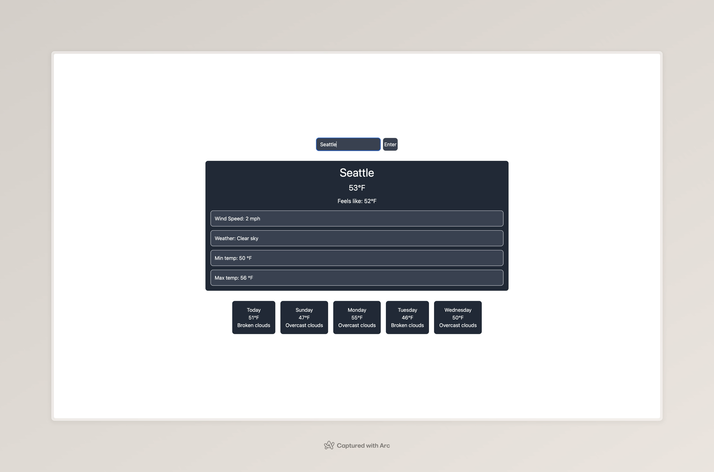

# Weather Dashboard

A weather dashboard that allows the user to search a city and see the current and 5 day forecast temperature. Built using React.JS, TailwindCSS, and Vite

## Live Demo

Deployed on [Vercel] https://weather-dashboard-chi-three-52.vercel.app/

## Screenshot

## Features

- Search for any city's current weather
- 5 day forecast with day of the week
- Recent search history with localStorage persistence
- Loading and error state handling

## Tech Stack

- React
- TailwindCSS
- Vite
- Git
- OpenWeatherAPI